# Functions

````julia
using Plots;
using CalculusWithJulia;

gr(fmt = :png)
````


````
Plots.GRBackend()
````


````julia
f(x) = 1 - x^2/2
plot(f, -3, 3)
````


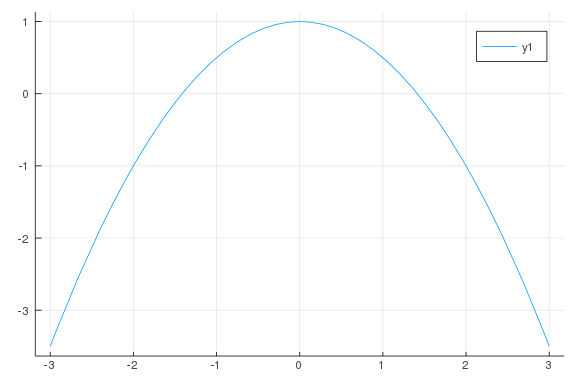

````julia
f(x) = cos(x)
g(x) = x^2 - x
h(x) = sqrt(x)

f(pi), g(2), h(4)
````


````
(-1.0, 2, 2.0)
````


````julia
cellplan(x) = x < 500 ? 20.0 : 20.0 + 0.05 * (x-500)

plot(cellplan, 0, 1000)
````


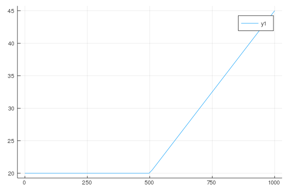

````julia
m, b = 2, 3
f(x) = m*x + b

plot(f, -3, 3)
f(0), f(2)
````


````
(3, 7)
````


````julia
f(x; m=1, b=0) = m*x + b

f(0)
f(0, m=3, b=2)

plot(f, -3, 3)
````


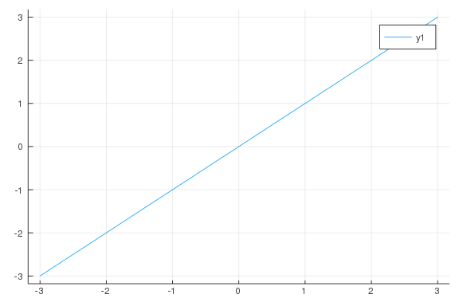

````julia
function f(x; g = 9.8, v0 = 200, theta = 45, k = 1/2)
  a = v0 * cosd(theta)
  (g/(k*a) + tand(theta))* x + (g/k^2) * log(1 - k/a*x)
end

plot(f, -10, 10)
````


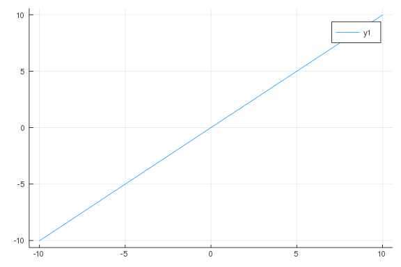

````julia
methods(log, (Number,)) |> collect
````


````
[1] log(a::Float16) in Base.Math at math.jl:1114
[2] log(a::Complex{Float16}) in Base.Math at math.jl:1115
[3] log(x::Float64) in Base.Math at special/log.jl:254
[4] log(x::Float32) in Base.Math at special/log.jl:290
[5] log(x::BigFloat) in Base.MPFR at mpfr.jl:672
[6] log(::Irrational{:ℯ}) in Base.MathConstants at mathconstants.jl:95
[7] log(x::ImplicitEquations.OInterval) in ImplicitEquations at C:\Users\bm
ore\.juliapro\JuliaPro_v1.4.1-1\packages\ImplicitEquations\H1dxT\src\interv
als.jl:217
[8] log(x::Sym) in SymPy at C:\Users\bmore\.juliapro\JuliaPro_v1.4.1-1\pack
ages\SymPy\1Cwgd\src\mathfuns.jl:40
[9] log(z::Complex{T}) where T<:AbstractFloat in Base at complex.jl:564
[10] log(z::Complex{T}) where T<:IntervalArithmetic.Interval in IntervalAri
thmetic at C:\Users\bmore\.juliapro\JuliaPro_v1.4.1-1\packages\IntervalArit
hmetic\1T5or\src\intervals\complex.jl:101
[11] log(z::Complex) in Base at complex.jl:583
[12] log(d::ForwardDiff.Dual{T,V,N} where N where V) where T in ForwardDiff
 at C:\Users\bmore\.juliapro\JuliaPro_v1.4.1-1\packages\ForwardDiff\cXTw0\s
rc\dual.jl:202
[13] log(a::IntervalArithmetic.Interval{T}) where T in IntervalArithmetic a
t C:\Users\bmore\.juliapro\JuliaPro_v1.4.1-1\packages\IntervalArithmetic\1T
5or\src\intervals\functions.jl:299
[14] log(xx::IntervalArithmetic.DecoratedInterval{T}) where T in IntervalAr
ithmetic at C:\Users\bmore\.juliapro\JuliaPro_v1.4.1-1\packages\IntervalAri
thmetic\1T5or\src\decorations\functions.jl:336
[15] log(x::Real) in Base.Math at special/log.jl:395
````


````julia
Area(w, h) = w * h

h(w) = (20 - 2*w)/2

Area(w) = Area(w, h(w))
````


````
Area (generic function with 2 methods)
````


````julia
plot(Area, 0, 10)
````


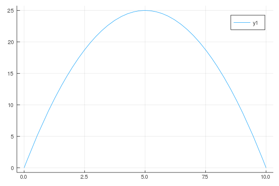


$g(x) = f(x - c)$

````julia
f(x) = x^2 - 2x
g(x) = f(x - 3)

plot(f, -3, 3)
plot!(g, -3, 3)
````


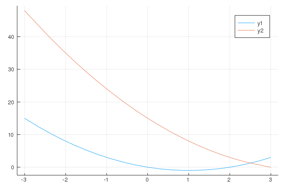

````julia
function shift_right(f; c=0)
  function(x)
    f(x - c)
  end
end
````


````
shift_right (generic function with 1 method)
````


````julia
f(x) = x^2 - 2x
l = shift_right(f, c=3)

plot(f, -5, 5)
plot!(l)
````


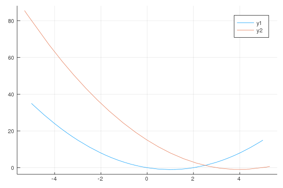

````julia
shift_right(f, c=0) = x -> f(x - c)
````


````
shift_right (generic function with 2 methods)
````


## Secant Line

$m = \frac{f(b) - f(a)}{b - a}$

$y = f(a) + m * (x - a)$

````julia
function secantf(f, a, b)
  m = (f(b) - f(a)) / (b - a)
  x -> f(a) + m * (x - a)
end
````


````
secantf (generic function with 1 method)
````


````julia
f(x) = x^2 - 2
a, b =  -5, 2

sf = secantf(f, a, b)

plot(f, -10, 10)
plot!(sf, -5, 2)
````


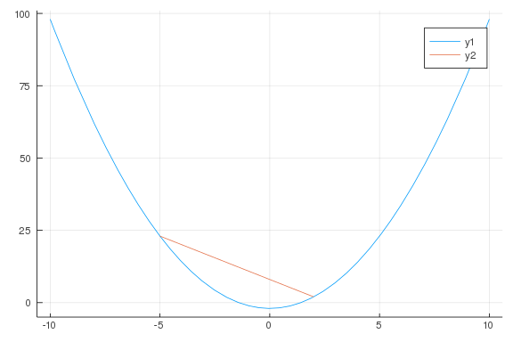

````julia
function secant_intersection(f, a, b)
  # solve 0 = f(b) + m * (x-b) where the slope of the secant line
  # x = b - f(b)/m
  m = (f(b) - f(a)) / (b - a)
  b - f(b) / m
end
````


````
secant_intersection (generic function with 1 method)
````


````julia
f(x) = x^2 - 2
a, b = 1, 2
c = secant_intersection(f, a, b)
````


````
1.3333333333333335
````


````julia
plot(f, 1, 1.5, color = :lightblue, linewidth = 3)
plot!([c], [f(c)], color = "black", line = :dot, linewidth = 4)
hline!([0], color = :red, linewidth = 1)
````


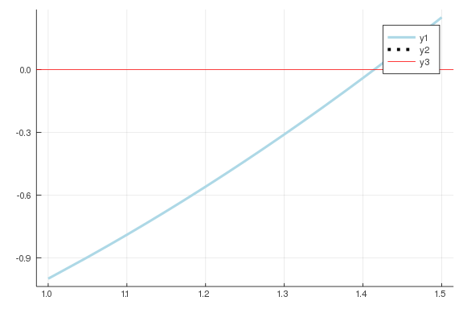

````julia
f(x; mu=0, sigma=1) = 1/sqrt(2pi*sigma) * exp(-(1/2)*(x-mu)^2/sigma)

plot(f)
````


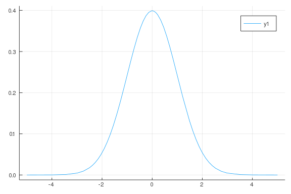

````julia
(sin ∘ cos)(pi/4)

sin ∘ cos(pi/4)
````


````
#64 (generic function with 1 method)
````


````julia
secant_intersection(f, a, b) = b - f(b) * (b - a) / (f(b) - f(a))  # rewritten
f(x) = x^2 - 2
a, b = 1//1, 2//1
c = secant_intersection(f, a, b)

a, b = b, c
c = secant_intersection(f, a, b)

a, b = b, c
c = secant_intersection(f, a, b)

plot(f)
````


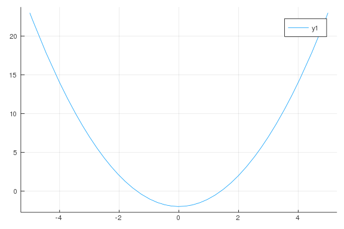
