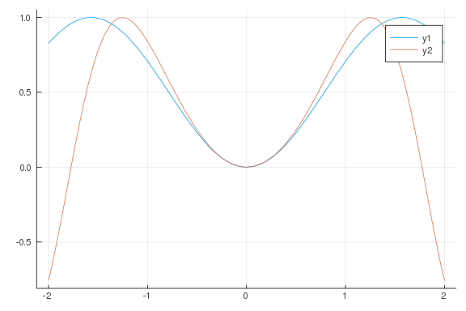
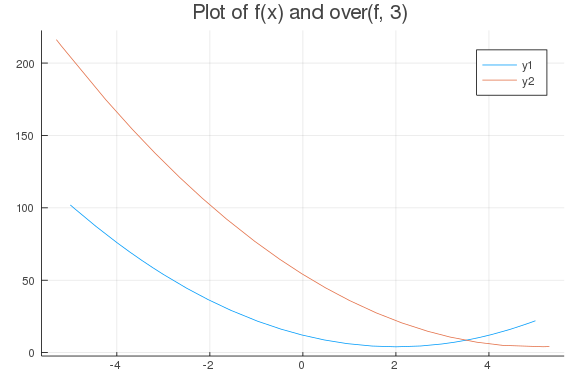
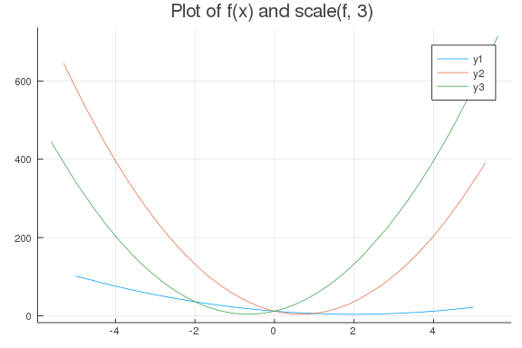
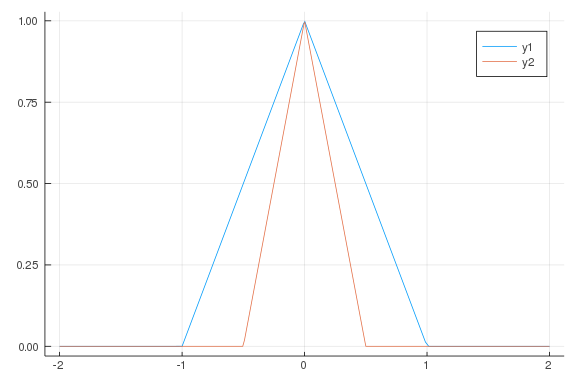
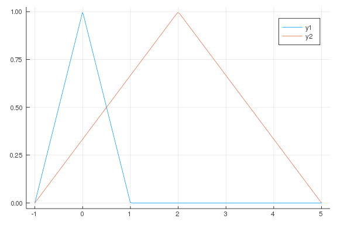

# Transformations

$f+g(x) = f(x) + g(x)$

````julia
using Plots
using CalculusWithJulia
````


````julia
import Base:+
f::Function + g::Function = x -> f(x) + g(x)

(sin + sqrt)(4)

plot((sin + sqrt))
````


````julia
f(x) = x^2
g(x) = sin(x)
fg = f ∘ g      # typed as f \circ[tab] g
gf = g ∘ f      # typed as g \circ[tab] f
plot([fg, gf], -2, 2)
````




````julia
up(f, k) = x -> f(x) + k
over(f, k) = x ->f(x - k)
stretch(f, k) = x -> k * f(x)
scale(f, k) = x -> f(k * x)
````


````
scale (generic function with 1 method)
````


````julia
f(x) = 2x^2 - 8x + 12

plot(f, title = "Plot of f(x) and up(f, 3)")
plot!(up(f, 3))
````


````julia
plot(f, title = "Plot of f(x) and over(f, 3)")
plot!(over(f, 3))
````




````julia
plot(f, title = "Plot of f(x) and stretch(f, 3)")
plot!(stretch(f, 3))
plot!(stretch(f, -3))
````


````julia
plot(f, title = "Plot of f(x) and scale(f, 3)")
plot!(scale(f, 3))
plot!(scale(f, -3))
````




````julia
f(x) = max(0, 1 - abs(x))
plot([f, up(f, 2)], -2, 2)
plot([f, over(f, 2)], -2, 4)
plot([f, stretch(f, 2)], -2, 2)
plot([f, scale(f, 2)], -2, 2)
````




````julia
plot([f, up(over(f,2), 1)], -2, 4)
plot([f, scale(over(f,2), 1/3)], -1,9)
````


````julia
plot([f, over(scale(f, 1/3), 2)], -1, 5)
````





$h(x) = \frac{1}{a}f(\frac{x - b}{a})$
